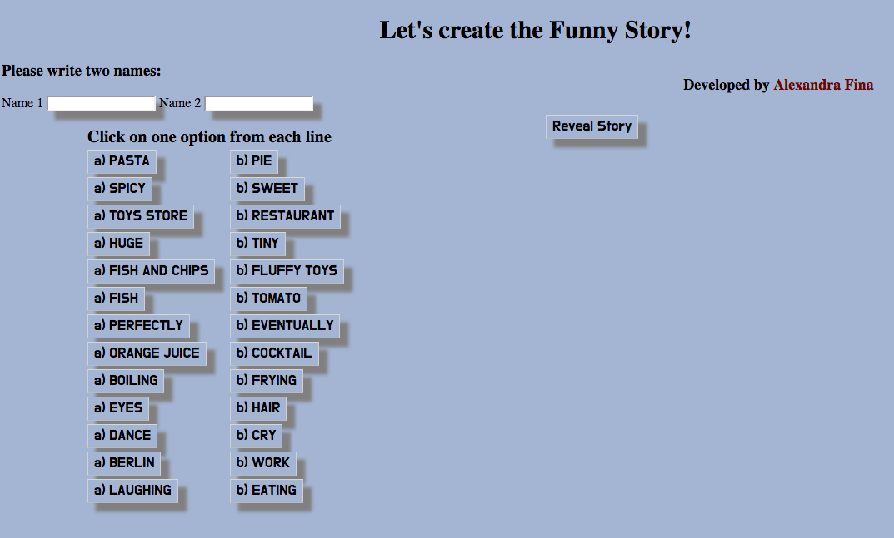

## Funny Story (Javascript)

## How to create the funny story:

```
You need to fill in the boxes with two names, choose one option
out of the two options available on each line (a or b)
and then click on the Reveal Story button and get ready to laugh!
Enjoy the funny story!
```

## How to play using command line

1. On your command line type ``` git clone git@github.com:AlexandraGF/funnyStory-JavaScript.git ```
2. Then change the directory by typing ``` cd funnyStory-Javascript ```
3. Type ``` open index.html ``` and your browser will open the file.
4. Enjoy!

## How to play directly on the internet

1. Click on the link [Funny Story](https://alexandragf.github.io/funnyStory-JavaScript/)
2. Enjoy!

## How to run the tests (Jasmine testing)

1. On your command line type ``` git clone git@github.com:AlexandraGF/funnyStory-JavaScript.git```
2. Then change the directory by typing ``` cd cd funnyStory-Javascript/jasmine ```
3. Type ``` open SpecRunner.html ``` and your browser will open the passing tests.

## Screenshots from the Funny Story




